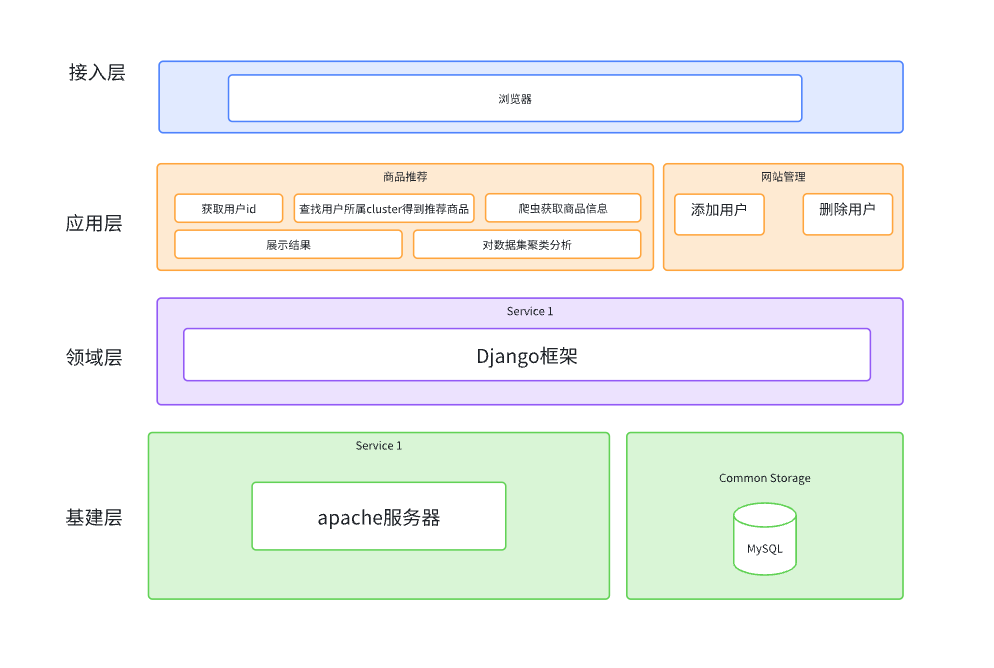
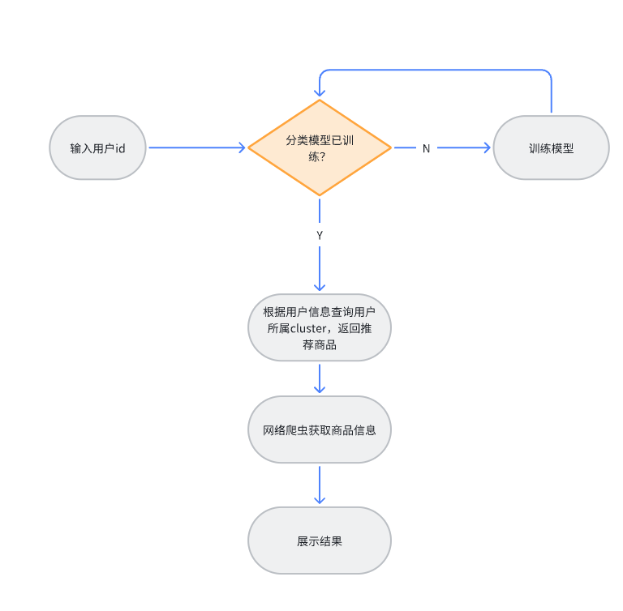
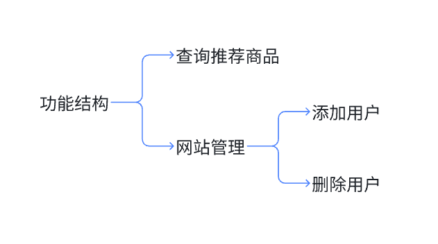
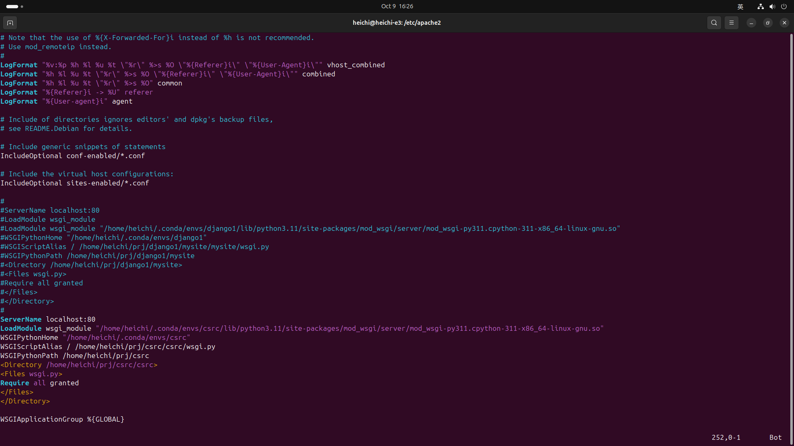
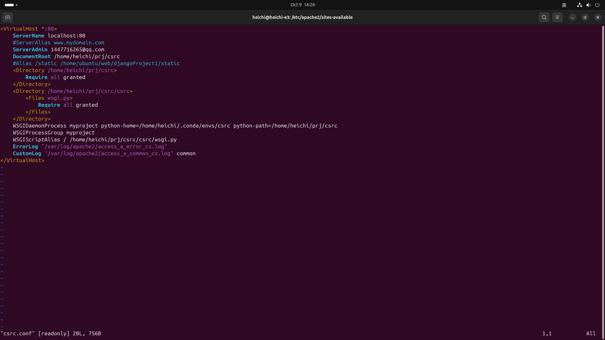
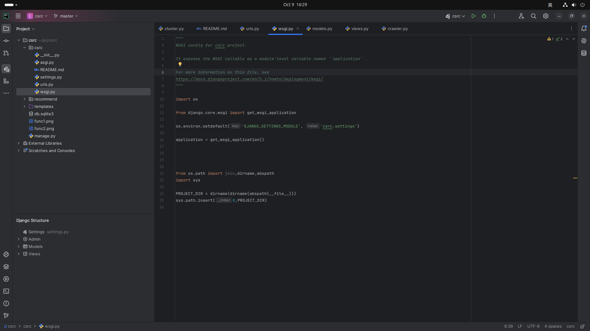
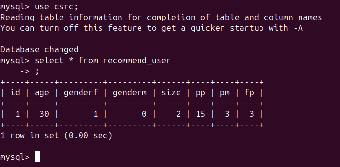
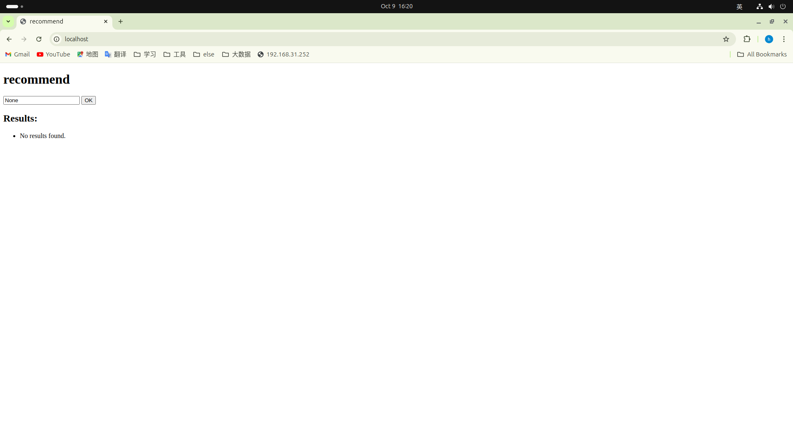
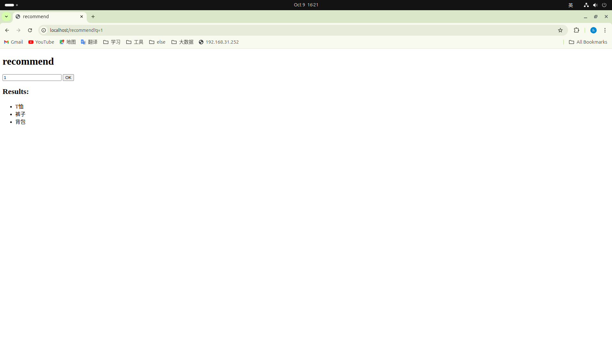

 <h1>客户细分与个性化推荐引擎</h1>

 python大数据处理与分析大作业

# 一、应用背景

当今时代，电子商务、网络购物已成为人们生活的一部分，每当我们打开购物软件，就会看到让人眼花缭乱的商品。这些商品总能引起我们的兴趣，让我门忍不住点击进去看看详细信息，甚至直接买下。软件是如何做到这么精准的推送的呢？为了深刻理解购物软件背后的推荐算法以及其在应用中的实现，我们做了客户细分与个性化推荐引擎。

# 二、采用的关键技术

## 1、大数据处理与分析

### *k-means聚类分析*

数据集：[Consumer Behavior and Shopping Habits Dataset: | Kaggle](https://www.kaggle.com/datasets/zeesolver/consumer-behavior-and-shopping-habits-dataset)

K-means 聚类分析是一种常用的无监督学习算法，用于将数据集划分为 K 个簇（clusters），使得同一簇内的数据点尽可能相似，而不同簇之间的数据点则尽可能不同

### *协同过滤*

协同过滤（Collaborative Filtering）是一种推荐系统技术，基于用户与物品之间的交互数据来进行推荐，主要用于个性化推荐，如电影、音乐、商品等。其核心理念是利用用户的历史行为和偏好来预测其可能感兴趣的内容。

## 2、网站应用

### *apache服务器*

Apache 服务器（Apache HTTP Server）是一个开源的、跨平台的 Web 服务器软件，由 Apache 软件基金会开发和维护。它是互联网最流行的 Web 服务器之一，广泛用于托管和服务网站。

### *django框架*

Django 是一个高效的开源 Web 应用框架，使用 Python 编程语言开发。它遵循“快速开发”和“重用代码”的原则，旨在帮助开发者快速构建高质量的 Web 应用

# 三、项目的架构图、流程图、功能结构图

*架构图*：

项目使用本地主机做服务器硬件，使用apache2做web服务器，使用mysql做数据库，使用django做网站框架，实现了用户查询推荐商品功能和网站管理员管理站点功能。

*流程图*：

服务器启动后将自行训练聚类分析模型，若用户访问时未训练，将训练后继续执行。根据用户信息找到用户所属cluster后，返回所在cluster最受欢迎商品，使用网络爬虫获取相关商品信息展示给用户。

*功能结构图*：

# 四、功能模块分析
网站实现部分与课程关系不大，因此只分析大数据处理与分析部分。
导入包

    import pandas as pd
    import seaborn as sns
    from matplotlib import colors
    from sklearn.preprocessing import LabelEncoder
    from sklearn.decomposition import PCA
    from yellowbrick.cluster import KElbowVisualizer
    from sklearn.cluster import KMeans
    import matplotlib.pyplot as plt, numpy as np
    from sklearn.cluster import AgglomerativeClustering
    import warnings
    import sys

读取数据集文件

    # load file
    data = pd.read_csv('shopping_behavior_updated.csv')
    existing_df = pd.read_csv('shopping_behavior_updated.csv')

删除无用数据

    # Drop some columns
    to_drop = ['Promo Code Used', 'Customer ID', 'Location']
    data.drop(to_drop, axis=1, inplace=True)
    object_cols.remove('Promo Code Used')
    object_cols.remove('Location')

数据编码

    # encoding
    
    # with level,ordinal encoding
    ord_map1 = {'No':0, 'Yes':1}
    ord_map2 = {'Store Pickup':0, 'Free Shipping':0, 'Standard':1,'2-Day Shipping':2,'Express':3,'Next Day Air':4}
    ord_map3 = {'No':1, 'Yes':0}
    ord_map4 = {'Debit Card':0,'Credit Card':0, 'PayPal':1, 'Bank Transfer':2, 'Cash':2,'Venmo':2}
    ord_map5 = {'Annually':1, 'Quarterly':2,'Every 3 Months':3,'Monthly':4,'Fortnightly':5,'Bi-Weekly':5,'Weekly':6}
    ord_map6 = {'S':1,'M':2,'L':3,'XL':4}
    
    data['Subscription Status'] = data['Subscription Status'].map(ord_map1)
    data['Shipping Type'] = data['Shipping Type'].map(ord_map2)
    data['Discount Applied'] = data['Discount Applied'].map(ord_map3)
    data['Payment Method'] = data['Payment Method'].map(ord_map4)
    data['Frequency of Purchases'] = data['Frequency of Purchases'].map(ord_map5)
    data['Size'] = data['Size'].map(ord_map6)
# 五、软件功能演示
1. 部署 \
apache配置

django配置

mysql配置

2. 功能

